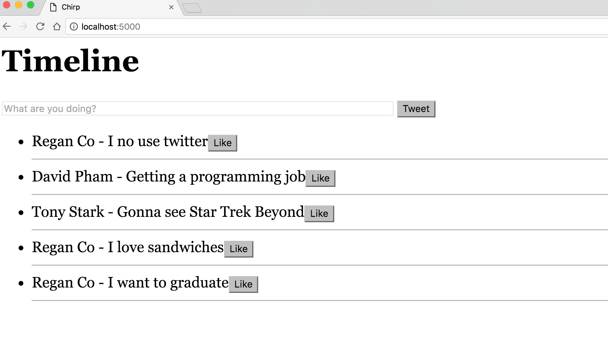

# Chirp - an imitation twitter app

##Objective
To recreate twitter leveraging PostgreSQL, Python, Jinja templates. With this project, we hope to create the core functionalities and focus less on the appearance.

My classmate, Regan [@rrgn](https://github.com/rrgn) encountered several obstales:
* Making our query pulls adapt to customize login credentials. Initially the queries would pull all the data for all users (select *). This was improved by binding the data using $1 or $d ('d' for digit, 's' for string, 'r' for raw data).
 
```node
    query = db.query("select * from users where **users.username = $1 AND users.password =$2", username,password)
    login_validation = query.namedresult()'''
```
OR

```node
    username = session['username']
    timeline_query = db.query('''
        select
        tweet_table.tweet_content, tweet_table.id as tweet_id, tweet_table.hearts_amount
    from users
    left outer join
        tweet_table on users.id = tweet_table.user_id
    where users.username = '%s'
    ''' % username)
```

* I learned that with pygre(postgresql integration with python) is a bit tricky with method posts for routes. Pushing it all into one route was not working, because I belive it would be routing to itself. Instead, had to create 2 routes for taking input information in like username and then redirecting/rendering pages. To clarify, a login would need 2 routes: 1 to render the page, the 2nd to process/post the inputted information:

```
    @app.route('/login')
    def login():
    return render_template('login.html')
```
```
    @app.route('/goLogin', methods = ['POST'])
    def goLogin():
    return render_template('/login.html')
```

#Phase 1: Setting up pages
------


------
------
------

#Phase 2: Associating each page with username credentials, creating signup page
------


